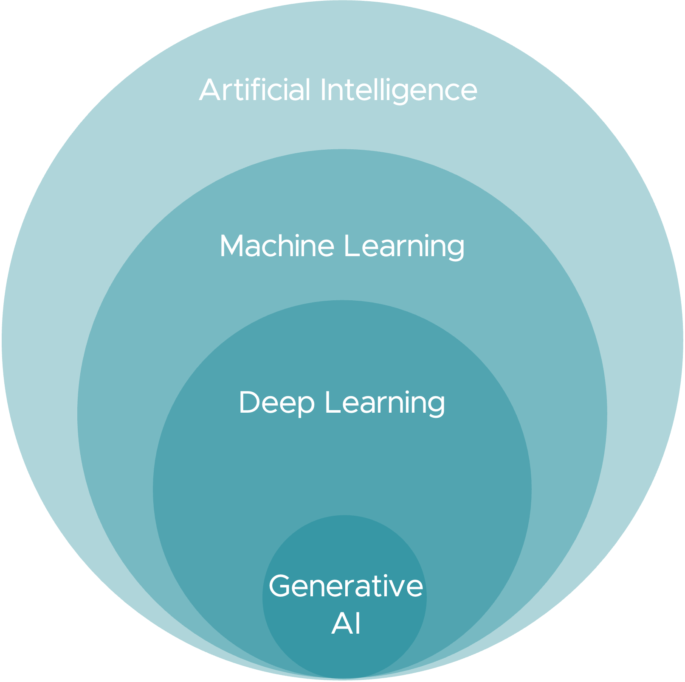
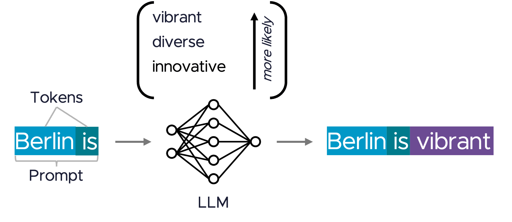
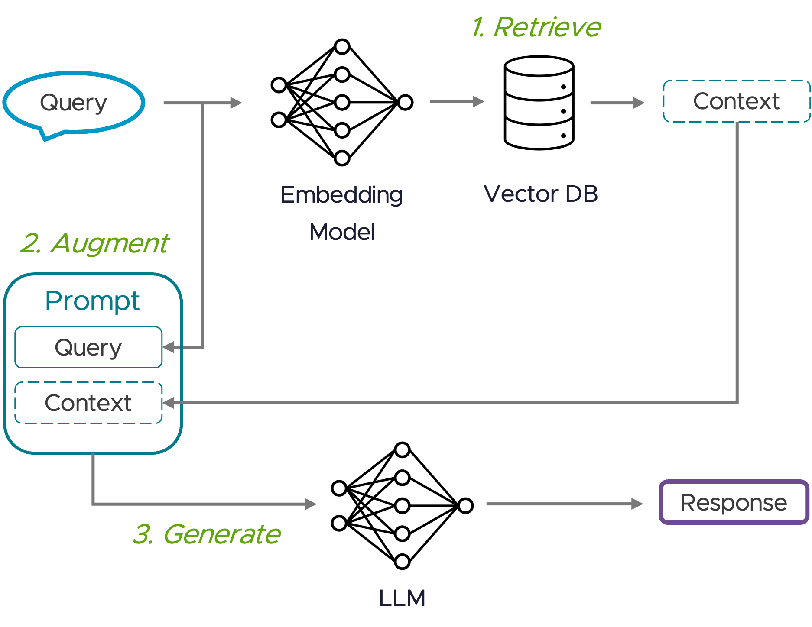

# AI Fundamentals for Java Developers

Before diving into code, let's understand the key AI concepts you'll encounter throughout this workshop.

## The AI Hierarchy



**Artificial Intelligence (AI):** The broad field of creating machines capable of performing cognitive functions typically associated with human minds.

**Machine Learning (ML):** A subset of AI where algorithms learn from data to make predictions without being explicitly programmed.

**Deep Learning:** ML algorithms that simulate how the human brain's neurons work using Neural Networks.

**Generative AI:** AI capable of generating new content (text, images, code) by learning patterns from training data.

## Large Language Models (LLMs)



**LLMs** are AI models specifically designed to understand and generate human language. They work by:

1. **Tokenization**: Breaking text into tokens (words or subwords)
2. **Pattern Recognition**: Processing tokens through neural networks
3. **Prediction**: Predicting the most likely next token based on context

### Key Terminology

| Term | Definition |
|------|------------|
| **Prompt** | Input text given to the model to guide generation |
| **Token** | Basic unit of text |
| **Context Window** | Maximum tokens the model can process at once |
| **Completion** | The model's generated response |

## Token Economics

Understanding tokens is crucial for cost management:

```
Input:  "Tell me about Spring Boot" = ~5 tokens
Output: A 100-word response = ~133 tokens
```

**Pricing Example (GPT-4o):**
- Input: $2.50 per 1M tokens
- Output: $10.00 per 1M tokens


This workshop uses a mock service by default, so you won't incur API costs while learning.


## Adapting Foundation Models

Instead of training models from scratch (expensive!), we adapt existing models:

### Prompt Engineering
Designing effective prompts to guide model outputs:
- **Zero-shot**: Direct question without examples
- **Few-shot**: Providing examples in the prompt
- **Chain-of-thought**: Asking the model to reason step-by-step

### Function/Tool Calling
Connecting models to external systems:
- Register functions the model can call
- Model decides when to use tools
- Results are incorporated into responses

### Retrieval-Augmented Generation (RAG)



RAG enhances model outputs by incorporating external knowledge:

1. **Index**: Convert documents to embeddings (vector representations)
2. **Retrieve**: Find relevant documents based on query similarity
3. **Generate**: Include retrieved context in the prompt

## Spring AI's Role

Spring AI provides a consistent programming model across AI providers:

- **Portable API**: Same code works with OpenAI, Anthropic, Ollama, etc.
- **Spring Integration**: Familiar patterns (DI, auto-configuration)
- **Production Features**: Observability, testing support

Ready to set up your environment? Let's continue!
