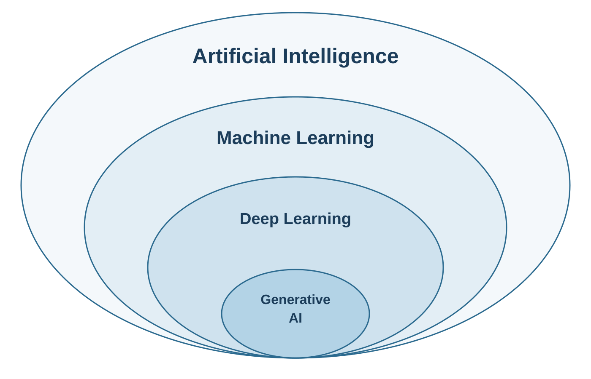
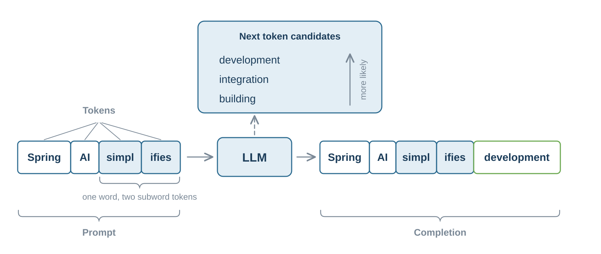

# AI Fundamentals

Artificial intelligence is a broad field that covers any technique that lets machines perform tasks which normally require human intelligence. It ranges from rule based systems and classic machine learning to computer vision and robotics.

Within that broad field sit several nested layers. **Machine Learning (ML)** is the part of AI where algorithms learn from data to make predictions instead of being programmed explicitly. **Deep Learning** is a further part of ML that uses neural networks, loosely inspired by the neurons in a brain, to learn complex patterns. **Generative AI** is the part of deep learning that does not only analyze or classify existing data but creates new content such as text, images, audio, and code.

Generative AI is therefore one specific corner of artificial intelligence, yet it is the corner that has captured the world's attention. When people say "AI" today, they almost always mean Generative AI, and most often the **Large Language Models (LLMs)** that power it.

## Why Is This Happening Now?

The ideas behind neural networks have existed for decades, so it is fair to ask why Generative AI suddenly feels like it is everywhere. Three forces came together at the same time.

The first was a breakthrough in architecture. In 2017 researchers at Google published the paper "Attention Is All You Need", which introduced the **transformer** architecture. Its core idea, the **attention mechanism**, lets a model weigh how strongly each word in a sequence relates to every other word. This captures context far better than earlier approaches, and it does so in a way that scales well on modern hardware.

The second force was scale. Researchers found that making these models much larger, and training them on more data with more computing power, kept producing better results. Capability grew with size in a way few people expected.

The third force was accessibility. The public release of capable chat assistants showed everyone, not only researchers, what these systems could do. That moment triggered the wave of investment, tooling, and adoption we are living through now.

## How LLMs Work

Despite their sophistication, LLMs do something that is simple to describe. Given a piece of text, they predict the most likely next piece of text, and then they repeat that step over and over. Scaled up across billions of examples, this prediction produces answers that are coherent, fit the context, and are often surprisingly creative.

A handful of terms describe how this works in practice, and they come back throughout the course.

The text you send to a model is called the **prompt**. It is your instruction and your context combined, and its quality has a large effect on the quality of the answer. The text the model sends back is the **completion**.

Models do not read characters or whole words directly. They first break text into **tokens**, which are small chunks that can be a whole word, part of a word, or a piece of punctuation. Tokens strike a balance between characters, which would make sequences far too long, and whole words, of which there are too many across all languages. Subword tokens let a model cover any text efficiently with a vocabulary it can manage. As a rough guide, a short request like "Tell me about Spring AI" is around five tokens, while a hundred word answer is around one hundred and thirty. You can see how text is split with the [OpenAI Tokenizer](https://platform.openai.com/tokenizer), for example.

Tokens matter for two practical reasons. They define how much a model can handle at once, and they are the currency of AI. With a hosted provider you pay per token for what you send and for what you receive, so the number of tokens directly drives your cost. When you run a model on-premises you no longer pay per token, but the cost does not disappear. It moves to the compute you have to provide, because longer inputs and outputs mean more work on your own hardware.

The capacity a model can handle at once is the **context window**, the maximum amount of text, measured in tokens, that a model can consider in a single request. It includes your prompt and the completion, so a larger context window lets the model take more information into account, although it also costs more.

Modern context windows are often hundreds of thousands of tokens, which sounds enormous next to the small examples above. In practice a good part of that space is already taken before your own input arrives. AI providers fill part of the window with system instructions that guide the behavior of the model and with guardrails that keep it safe, and in a real application you add your own instructions, the conversation history, and retrieved context on top.

The underlying capability of a model comes from its **parameters**, the internal values it learns during training. Modern models have billions of them, and more parameters usually mean a more capable but also more expensive model.

## Limitations of LLMs

For all their power, LLMs have real limitations, and you should understand them before you build anything serious.

They can **hallucinate**, which means giving a confident answer that is simply wrong, because they predict plausible text rather than look up verified facts.

Their knowledge is **frozen at training time**. A model knows nothing about what happened after its training cutoff, and it knows nothing about your private or company specific data.

They are also **stateless**. A model has no memory of earlier interactions unless you send that history again with every request, and how much history you can send is limited by the context window.

On their own, LLMs **cannot take actions** in the outside world. They cannot query a database, call an API, or send an email without help.

And because they are **probabilistic**, the same prompt can produce different answers on different runs, which makes consistency and testing harder than in traditional software.

## Where Spring AI Fits In

Much of the recent progress in applied AI is about softening exactly these limitations, and the patterns involved are maturing quickly.

The capabilities of Spring AI are built around making those patterns practical for Java developers. By the end of this course you can build applications that go well beyond what a bare LLM can do on its own.
