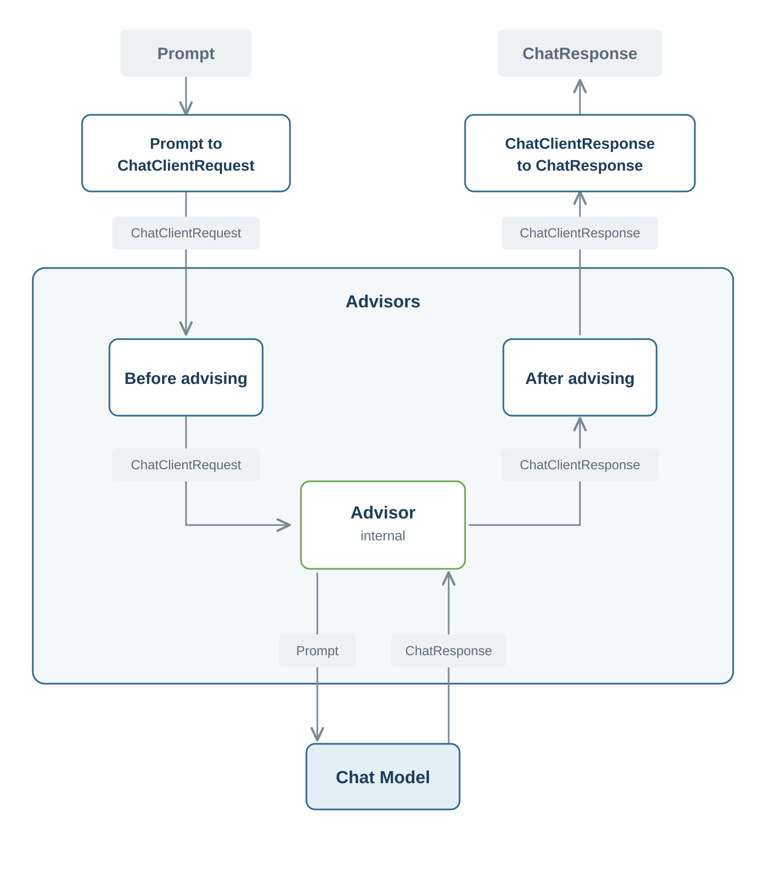
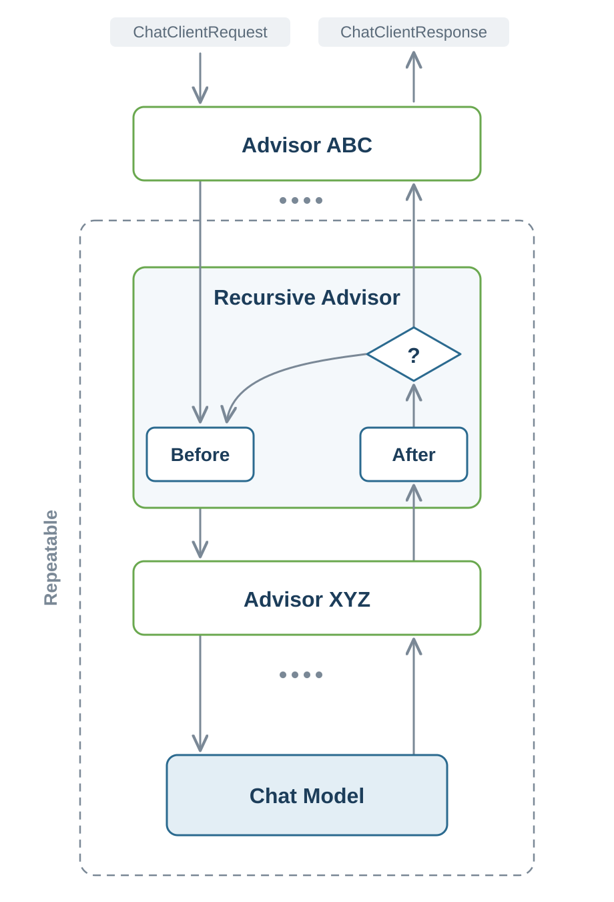

# Spring AI Fundamentals: The Advisors API

So far you have used the `ChatClient` to send a prompt and shape the response, and you have configured shared defaults such as a system prompt on the client itself. Real applications need more than that. They need behavior that runs *around* every call, whatever the prompt is. Think of logging each request and response, keeping the conversation history, blocking unwanted content, or retrieving documents to ground an answer. You do not want that logic scattered through every service method.

Spring AI solves this with **advisors**. An advisor is the extension point that lets you add such cross-cutting behavior once and apply it to every call a `ChatClient` makes, while your prompting code stays the same fluent chain you already know.

## The Advisors API

Interceptors let a programmer take control of an execution by stepping into it, and Spring supports many of them for different purposes, such as the `HandlerInterceptor` or the `ClientHttpRequestInterceptor`. If you have used one of those, advisors will feel familiar.

An advisor is an **interceptor that wraps a `ChatClient` call**, with a chance to act both *before* the request reaches the model and *after* the response comes back. Several advisors form a **chain**, and a request passes through all of them on the way in, hits the model, and passes back through them on the way out. This is the classic around pattern. Each advisor can inspect and modify the request, decide whether to proceed, and then inspect and modify the response.



Concretely, the framework wraps your `Prompt` in a **`ChatClientRequest`**, which is the request plus a shared context map, and hands it to the first advisor. Each advisor does its *before* work, then calls the chain to invoke the next advisor, and the last one calls the model. The answer of the model travels back as a **`ChatClientResponse`**, and each advisor gets to do its *after* work as the chain unwinds. A logging advisor shows the shape nicely, because it logs on the way in, delegates to the rest of the chain, and logs on the way out.

```java
ChatClientResponse adviseCall(ChatClientRequest request, CallAdvisorChain chain) {
    logRequest(request);                                 // before
    ChatClientResponse response = chain.nextCall(request); // delegate down the chain → model
    logResponse(response);                               // after
    return response;
}
```

A few properties are worth understanding, because they explain how advisors behave when you combine them.

- **Name** Each advisor returns a unique name from `getName()`. It identifies the advisor in the chain, so it shows up in logs and lets you refer to a specific advisor when you need to.
- **Order** Each advisor reports a priority through `getOrder()`, the method it inherits from the `Ordered` interface of Spring. A lower value runs first on the way *in*, and on the way *out* the order reverses, just like nested method calls. So an advisor that adds context before the model also gets the first look at the response.
- **Blocking and reactive** The same advisor can implement the blocking `.call()` path with `CallAdvisor` and the reactive `.stream()` path with `StreamAdvisor`, so cross-cutting behavior works whether you wait for the whole answer or stream it.
- **Shared context** A context map travels with the request through the whole chain. This is how you pass per request parameters to an advisor at call time, for example to tell a memory advisor which conversation this is.

The order is a plain `int`, and `Ordered` names the two extremes for you.

```java
int HIGHEST_PRECEDENCE = Integer.MIN_VALUE; // runs first on the way in
int LOWEST_PRECEDENCE  = Integer.MAX_VALUE; // runs last on the way in
```

A logging advisor that should record the final request, after every other advisor has shaped it, returns `LOWEST_PRECEDENCE` so it runs last. The built-in chat memory advisor, which must add the history before the model sees it, sits near `HIGHEST_PRECEDENCE`.

You read and write that shared context through the `context()` map on the request. The request is immutable, so you produce an updated copy with your entry added instead of changing it in place.

```java
Object conversationId = request.context().get("conversationId"); // read
ChatClientRequest updated = request.mutate()
    .context("retrievedAt", Instant.now())                       // write
    .build();
```

You register advisors in one of two places. Either on a `ChatClient` instance as defaults, which applies them to every call made through that client.

```java
ChatClient chatClient = builder
    .defaultAdvisors(new SimpleLoggerAdvisor())  // logging on every call
    .build();
```

Or you attach them **per request**, when a single call needs behavior that the defaults of the client do not include. This is also where you feed dynamic values into that shared context map, by passing a parameter to the advisor at call time.

```java
String answer = chatClient.prompt()
    .user("How do I reset my password?")
    .advisors(new SimpleLoggerAdvisor())
    .call()
    .content();
```

## Built-in Advisors

Spring AI ships a set of built-in advisors for exactly these recurring patterns. The structured output parsing you already used is implemented in the `ChatModelCallAdvisor` and configured by default. The **chat memory advisors** keep the conversation history, the **`SafeGuardAdvisor`** blocks unwanted content, the **`SimpleLoggerAdvisor`** logs the request and the response, the **`ToolCallingAdvisor`** runs the tool calling loop, and the **RAG advisors** ground answers in your own documents. You will meet the tool calling and RAG advisors in the advanced patterns module.

## The Chat Memory Advisor

A language model has no memory of its own. Each call is stateless, so on its own the model cannot remember what the user said a moment ago. The chat memory advisor fills that gap. It stores the messages of a conversation and replays them on the next call, so the model sees the earlier turns and can answer a follow up question in context.

Spring AI offers two variants. The **`MessageChatMemoryAdvisor`** retrieves the past messages and adds them to the prompt as real message objects, which keeps the original user and assistant roles. The **`VectorStoreChatMemoryAdvisor`** stores the history in a `VectorStore` and pulls back only the most relevant pieces as text, which suits very long conversations where replaying everything would be wasteful. For most applications the message variant is the right default.

Both advisors leave the actual storage to a **`ChatMemory`**. The default implementation is **`MessageWindowChatMemory`**, a sliding window that keeps the most recent messages up to a limit, 20 by default, and drops the oldest whole turns once the window is full. You create an instance and hand it to the advisor.

```java
ChatMemory chatMemory = MessageWindowChatMemory.builder()
    .maxMessages(20)
    .build();

ChatClient chatClient = builder
    .defaultAdvisors(MessageChatMemoryAdvisor.builder(chatMemory).build())
    .build();
```

Where those messages actually live is the job of a separate **`ChatMemoryRepository`**. Out of the box you get an **`InMemoryChatMemoryRepository`**, which keeps everything in a map and loses it on restart, which is fine for a demo. For real deployments Spring AI ships repositories backed by JDBC, Cassandra, Neo4j, MongoDB, and Redis, each added as a starter dependency and configured automatically. Swapping the store is a configuration change, so the advisor and your prompting code stay the same.

The one thing the advisor needs from you at call time is a **conversation id**, so it knows which conversation to load and append to. You pass it as a per request parameter through the shared context, using the `ChatMemory.CONVERSATION_ID` key.

```java
String answer = chatClient.prompt()
    .user("And what about the second one?")
    .advisors(a -> a.param(ChatMemory.CONVERSATION_ID, "user-42"))
    .call()
    .content();
```

This id is required. If you leave it out, the advisor throws at runtime, because it has no way to tell one user's conversation from another. In practice you derive it from something stable such as the user or the session, so each user keeps a separate history.

## Recursive Advisors

Every advisor so far calls `chain.nextCall(request)` exactly once, so the request travels down the chain a single time. Some patterns need to reach the model more than once for one user call. Validating structured output, for example, means checking the answer against a schema and asking again when it does not fit.

A **recursive advisor** handles this by looping the downstream part of the chain.



Instead of calling `nextCall` once, it takes a copy of the chain that holds only the advisors after itself, with `chain.copy(this)`, and invokes that sub-chain as many times as it needs. Working on a copy keeps the ordering correct and makes sure the advisors before it do not run again on every loop.

```java
CallAdvisorChain downstream = chain.copy(this); // only the advisors after this one
ChatClientResponse response = downstream.nextCall(request);
int attempt = 1;
while (!matchesSchema(response) && attempt < maxAttempts) {
    request = mutateRequestWithFeedback(request, response); // point out how the JSON broke the schema
    response = downstream.nextCall(request);           // let the model correct itself
    attempt++;
}
```

Spring AI ships two recursive advisors. The **`StructuredOutputValidationAdvisor`** validates the response and retries a few times when it does not match your type. You do not register it yourself. Just like native structured output, you switch it on in the `entity()` call with `spec -> spec.schemaValidation()`, and Spring AI adds the advisor to the chain for you. The **`ToolCallingAdvisor`** runs the tool calling loop you will meet in the advanced patterns module.
