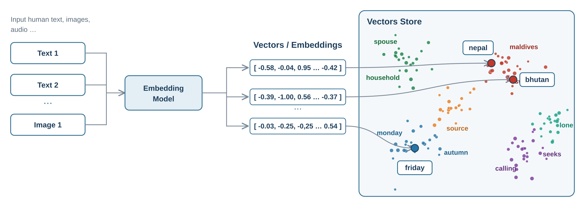
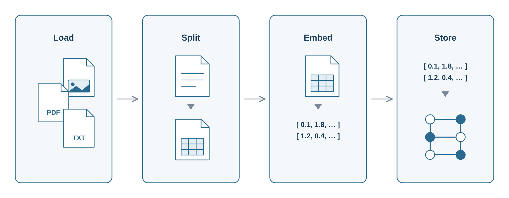
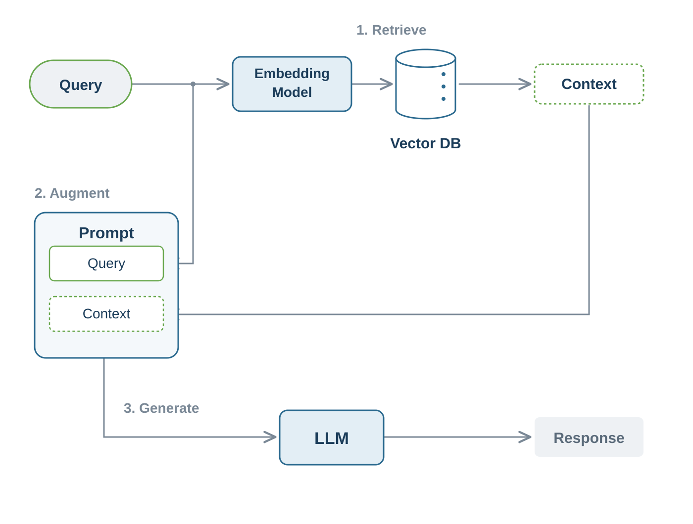
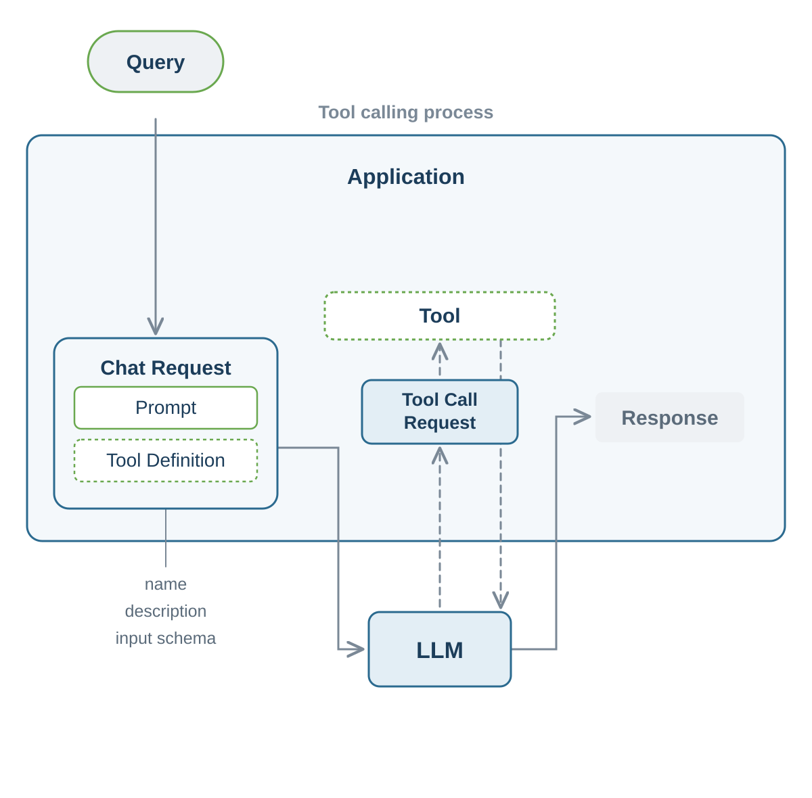

# Foundations of RAG and Tool Calling

A language model is a snapshot of the data it was trained on. Its knowledge is frozen at the moment that training data was collected, and that data is whatever was publicly available back then. If you ask about a framework that was released last month, the model has no way to know. Models also rarely admit the gap. Instead of saying that they do not know, they tend to produce a confident answer that sounds right but is wrong, which is called hallucination.

For an assistant that answers questions about your own product this is a serious problem. The whole point is to answer from your own documentation, including content the model has never seen and that changes over time.

One way to solve this is to fine tune a model on your data. That is expensive, slow to update, and has to be repeated every time the data changes. Another way is the prompt engineering you already met, where you paste the relevant information straight into the prompt by hand. That works for a small and stable amount of text, but it breaks down fast. A model can only read so much at once, because every prompt has a maximum context window, so a whole knowledge base simply does not fit. Even when it does fit, you pay for every token you send on every request, so putting large amounts of text into each prompt gets slow and expensive. On top of that you would have to know upfront which facts each question needs.

There is a more practical approach. Instead of baking the knowledge into the model, you fetch the relevant facts at question time and hand them to the model together with the question. The model then answers from that supplied context instead of from its frozen memory. The hard part is the fetching. The user asks in plain natural language, and your documents are written in plain natural language too, so you need a way to find the right passages by their meaning rather than by matching exact words.

This technique is called Retrieval Augmented Generation, or RAG. It is the most common pattern for building AI applications over private or fast changing data. The name describes the flow. You retrieve relevant information, use it to augment the prompt, and let the model generate an answer that is grounded in that information.

## Retrieval Augmented Generation (RAG)

RAG splits into two phases that run at different times.

The first phase is indexing. This is an offline job that you run ahead of time. You take your source documents such as PDFs, web pages, or text files, break them into smaller pieces, convert each piece into a form you can search by meaning, and store them. The pieces are small so that a search can return just the passage that answers a question instead of a whole document, and so that you only feed the model the relevant part rather than pages of unrelated text. This is a batch process that you run again whenever your documents change, and it does not happen on every user request.

The second phase is retrieval and generation. This runs online for each question. When a user asks something, you search the stored data for the most relevant pieces, attach them to the prompt as context, and call the model.

The bridge that makes both phases work is the embedding. It is what lets you find text by meaning instead of by keyword, so we start there.

### Embeddings Turn Meaning Into Numbers

An embedding is a numerical representation of a piece of content. It is an array of floating point numbers, called a vector, that captures the meaning of the content. The important property is that texts with a similar meaning produce vectors that sit close together in this numerical space, even when they share no words. The question "How do I reset my password" and the sentence "I forgot my login credentials" land near each other. A question about the weather lands far away. By measuring the distance between two vectors you measure how related two pieces of text are, and that is what makes search by meaning possible.

The length of that array is called the number of dimensions. Each embedding model has a maximum it can produce, for example 1536 numbers, and by default it always outputs that full size no matter how long the input text is. Some models also let you configure a smaller number of dimensions. More dimensions can capture finer shades of meaning, but they also take more storage and make the similarity search a little slower, so a lower setting trades a bit of accuracy for less storage and faster search. Vectors from two different models do not line up, so you must use the same embedding model, with the same dimensions, for indexing and for querying.

### The Vector Store and Similarity Search

Once your content is embedded you need somewhere to keep the vectors, and a fast way to find the ones nearest to a query vector. That is the job of a vector store. It is a database built for storing embeddings and running similarity search, which means finding the items whose vectors are closest to a given one.

You have two broad options here. Some stores are purpose built for vectors, such as Chroma, Pinecone, Weaviate, Milvus, or Qdrant. Others are databases you may already run that have added vector support, such as PostgreSQL with the pgvector extension, VMware Tanzu GemFire, Redis, or MongoDB Atlas. The second option is often attractive because it lets you keep your embeddings next to your existing data without adding a new system to operate.

A similarity search is usually shaped by two settings. The first caps how many documents come back and is often called top K. The second sets how close a match has to be to count and is often called a similarity threshold, which filters out weakly related noise. The vector is only used to find the matches and is never turned back into text. When you store a piece of content you keep its original plain text alongside the vector, and that stored text is what comes back in the result.

#### Filtering by Metadata

Search by meaning is powerful, but sometimes you also need exact constraints. You may want only documents for a given product version, language, or customer. For this you attach metadata to each stored piece of content, such as its source, category, or version. At search time you combine the search by meaning with a filter over that metadata.

### Getting Data In With the ETL Pipeline

We have skipped over how raw files become stored, searchable content. That is the indexing phase, and it follows a classic pattern called ETL, which stands for Extract, Transform, Load.

Extract reads a source and produces documents. A document is simply a piece of text plus some metadata. Readers exist for the formats you meet in practice, such as PDF, Office files, HTML, JSON, and plain text.

Transform reshapes those documents before they are stored. The most important transform is chunking, which breaks a large document into smaller pieces. Chunking matters more than it first looks. If you embed a whole fifty page manual as one vector, a search either returns all fifty pages or nothing, and the single vector is too blurry to match anything well. Splitting into focused chunks lets retrieval pull back exactly the paragraph that answers the question, and you only spend tokens on relevant context. Other transforms can enrich documents before storage, for example by adding keywords or a short summary as metadata so you have more to filter and match on later.

Load writes the finished pieces into the vector store. You run this pipeline once, and again whenever your documents change, to fill the store.

### Simple RAG and Modular RAG

The common case is straightforward. Embed the question, search the vector store, attach the results to the prompt, and call the model. This naive flow answers most needs well.

Real systems sometimes need more control over retrieval. The question might depend on earlier turns in the conversation, for example a follow up that asks about "its second largest city" without naming the country again. The query might be phrased badly for search, or written in a different language than your documents. You might want the assistant to refuse politely when nothing relevant is found instead of guessing.

For these cases the single retrieval step grows into a pipeline of stages that you mix and match like building blocks. The same stages show up across RAG implementations, even if each framework names them differently.

Before the search, you can reshape the question. This is where you fold the conversation history into a standalone query, rephrase an awkward question, or translate it into the language of your documents. You can also expand one question into several variations to widen the net, or route it. Routing sends a question to the right place, for example by picking the relevant collection of documents, choosing between several vector stores, or deciding whether to search at all instead of answering directly.

The search itself can pull from more than one source and combine the results. A common variant mixes vector search by meaning with classic keyword search, which is called hybrid search.

After the search, the matched documents can be reworked before they reach the model. You can re-rank them so the most relevant ones come first, drop weak matches, or compress them down to the parts that matter so you spend fewer tokens.

Finally, the generation stage controls how the context is framed and whether an answer is allowed when nothing relevant was found, so the assistant can refuse instead of guessing.

You do not need any of this on day one. It is enough to know that advanced RAG is built from these stages, and that you add them only when naive retrieval is not good enough.

RAG widened what the model knows by feeding it retrieved documents, but the model still only produces words. It cannot check the status of an order today, look up a customer record, file a support ticket, or send an email. It has no hands.

This is a hard limit of how models work. A language model is an isolated function from text to text. It cannot reach a database, call an API, or run code. Even for information it is frozen at training time, so it cannot tell you anything that is live, private, or specific to this user right now.

For a support assistant this is the difference between a chatbot that explains the refund policy and an assistant that can actually look up your order and start the refund. To cross that gap the model needs a way to reach into your application, and that mechanism is tool calling.

## Tool Calling

Tool calling, also called function calling, lets a model invoke pieces of your code, called tools, to fetch information or take action. The key thing to understand is that the model never runs anything itself. It cannot execute code, and it never touches your database or your APIs directly. Instead the flow is a short conversation.

First, together with the user prompt, you tell the model which tools are available. Each tool has a name, a description, and the parameters it accepts. Second, if the model decides that a tool would help, it does not answer in prose. It responds with a structured request to call a specific tool with specific arguments, for example a request to get the status of order number 1234. Third, your application executes that tool, running ordinary code, with full control over what it is allowed to do. Fourth, the result is sent back to the model. Fifth, the model continues with the tool result as new context and produces its final answer, or it requests another tool.

So the model is the decision maker and your code is the doer. The model decides whether to call a tool and with which arguments. Your application decides what the tool actually does. This separation is what makes tool calling both powerful and easy to reason about, because the model can only ask and can never act on its own.

Tools serve two broad purposes. One is information retrieval, which brings live or private data into the context of the model, such as the current time, an order status, or the subscription tier of a customer. The other is taking action, which makes something happen in your systems, such as creating a ticket, sending an email, or updating a record.

### The Description Is the Contract

The model decides whether and how to call a tool based entirely on the tool name, its description, and the descriptions of its parameters. Those texts are the documentation of the tool, written for the model to read. A vague description such as "does order stuff" leads to a tool that is called at the wrong times or with the wrong arguments. A clear description such as "get the current status of a customer order by its ID" leads to reliable use. Treat these descriptions as carefully as you treat the prompt itself. From them a framework can generate the formal input schema that the model needs, so you describe your method and the contract the model sees is derived for you.

### The Tool Calling Loop

A single user request might need more than one tool call. The model may have to check an order status, then decide whether to open a ticket, and it needs the result of each step before it can choose the next. This back and forth is the tool calling loop. The application sends the request, sees when the model asks for a tool, executes the matching code, feeds the result back, and repeats until the model produces a final answer instead of another tool request. The idea is general. The model drives the decisions and your application drives the work, turn by turn, until the task is done.

### Keeping Sensitive Data Away From the Model

Often a tool needs information that should not come from the model. The current user id, the tenant they belong to, or an auth token are values your application knows and must control. They are not values you would ever want the model to guess or be able to influence, because letting the model supply a tenant id would be a security hole. The safe pattern is to inject this data into the tool at execution time from your own application, so the model never sees it and cannot change it. What the model sees stays limited to what it legitimately needs to reason about, while your code keeps control over the sensitive inputs.

### A Word on Safety

Tools can act, so safety matters. The model decides which tools to call and with which arguments, and user input can steer it. Treat a tool call as untrusted input to your own code. Validate the arguments, limit what each tool is allowed to do, and inject anything security sensitive yourself instead of accepting it as a model parameter. The model proposes and your application disposes.

## RAG and Tool Calling Side by Side

Both patterns close a gap in what a bare model can do, but they solve different problems. RAG is in fact a specialized kind of information retrieval, so you can think of it as one particular tool the model can reach for. The table below sums up how the two compare.

| | RAG | Tool Calling |
| --- | --- | --- |
| Main goal | Let the model know more | Let the model do more |
| What it provides | Relevant text from your documents | Live data and actions from your systems |
| Can it change the world | No, it only reads and supplies context | Yes, it can also act, for example send an email or create a ticket |
| Who decides it runs | Your application, usually on every question | The model, when it judges that a tool would help |
| Freshness of data | As fresh as your last indexing run | As fresh as the system the tool reads from, right now |
| Typical building blocks | Embeddings, vector store, ETL pipeline | Tool definitions with name, description, and parameters |
| Relationship | A specialized form of information retrieval | The general mechanism, can include RAG as one tool |

The two are not rivals, and real assistants often use both. RAG grounds the answer in your documentation, while tool calling lets the same assistant look something up live or take an action for the user.
