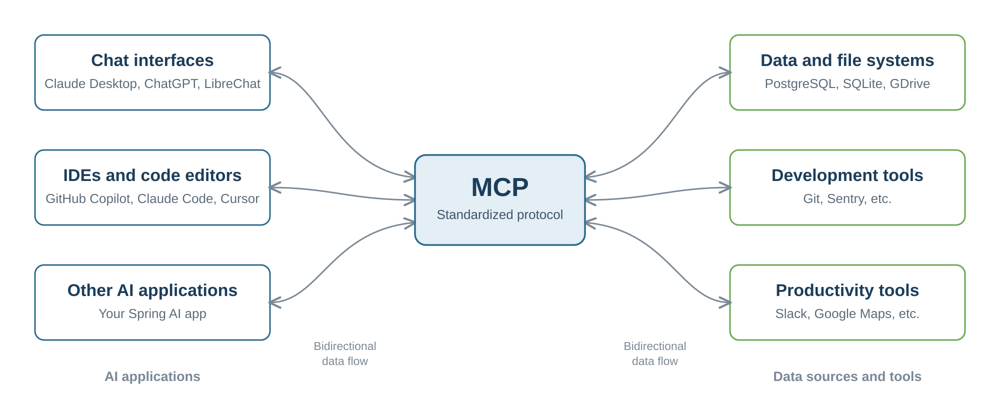
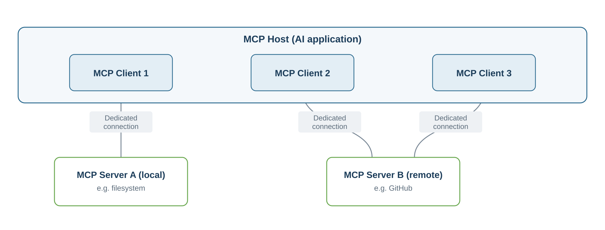

# Model Context Protocol (MCP)

Every tool your assistant can call so far lives inside its own codebase. You wrote the `@Tool` methods, they are compiled into your application, and only your application can use them. That works well until you look at the wider picture.

Think about how many AI applications exist today. There are chat assistants, coding assistants inside your editor, and the agents you build yourself. Now think about how many systems they might need to reach, such as your ticket system, your wiki, a database, or a build server. Before MCP, connecting one AI application to one system meant writing a custom integration. Ten AI applications and ten systems meant a hundred separate integrations, and every one of them had to be written and maintained by someone. The work was also not reusable. If a colleague built a good integration for their assistant, you could not simply plug it into yours.

This is the problem the **[Model Context Protocol (MCP)](https://modelcontextprotocol.io)** solves. It is an open-source protocol for connecting AI applications to external systems. A system exposes its capabilities once, and every MCP compatible AI application can use them without custom glue code. The official documentation compares MCP to a USB-C port. Just as USB-C gives you one connector that works with many devices, MCP gives you one way to connect AI applications to external systems.

The ecosystem behind it is already broad. Claude, ChatGPT, Visual Studio Code, Cursor and many other tools can act as MCP clients, and there is a growing collection of ready made servers for common systems. Because the protocol is language neutral, a server you write in Java with Spring AI can be used by a tool written in Python or TypeScript, and your Java assistant can use servers that somebody else wrote in another language.

MCP was originally created by Anthropic, but it no longer belongs to a single company. In late 2025 Anthropic donated the protocol to the [Agentic AI Foundation (AAIF)](https://aaif.io), a home for open-source agentic AI projects hosted under the Linux Foundation, the same organization that stewards well known projects such as Kubernetes. The foundation was set up to keep the building blocks of agentic AI open and vendor neutral so that no single vendor controls them. For you this matters because it means MCP is a genuinely open standard with long term backing, and the servers and clients you build against it are a safe thing to invest in.

## Architecture

MCP uses a client and server architecture with three roles. The **host** is the AI application itself, for example Claude Desktop, Visual Studio Code, or the support assistant you are building. The **server** is a program that offers capabilities, such as a server that can read your ticket system. The **client** sits inside the host and keeps one dedicated connection to one server.

That last point is worth repeating, because it often surprises people. A client always talks to exactly one server. When your host needs to reach three different servers, it creates three clients, one per server. This keeps each connection independent, so one slow or broken server does not disturb the others.

## How a Conversation Works

Underneath, MCP is built from two layers. The **data layer** defines the messages themselves and is based on JSON-RPC 2.0, a simple and well established format for remote calls. The **transport layer** defines how those messages travel and how the connection is secured. Because the two are separate, the same messages work over every transport.

A connection today starts with a handshake. The client sends an `initialize` request that says which protocol version it speaks and what it supports. The server answers with the same information about itself. This step is called capability negotiation, and it means neither side ever tries to use a feature the other does not have.

After the handshake the client asks what is available. It sends `tools/list`, for example, and gets back every tool with its name, its description, and a JSON schema describing its parameters. This is exactly the information a model needs to decide whether and how to call something. When the model does decide, the client sends `tools/call` with the arguments, and the server returns the result. Because discovery happens at runtime and not at compile time, a server can change its tools while it is running, and it can notify connected clients so they refresh their list.

## Two Ways to Connect

MCP defines two transports, and which one you use depends on where the server runs.

The **stdio** transport uses standard input and output. The host starts the server as a child process on the same machine and talks to it through those streams. There is no network involved, so it is fast and simple, and it suits a server that works with local files or local commands. Such a server normally serves just the one client that started it.

The **Streamable HTTP** transport is for servers reachable over a network. The client sends messages with HTTP POST, and the server can stream results back when it needs to. This is what you use for a real remote server, it can serve many clients at the same time, and because it is ordinary HTTP you can secure it with the mechanisms you already know, such as bearer tokens.

You will still meet an older remote transport called **HTTP with SSE**, which used one long lived Server-Sent Events stream to receive messages and a separate endpoint to send them. Keeping that stream open made the server stateful, which caused trouble behind load balancers. It is deprecated in the protocol, and Spring AI marks its SSE support as deprecated too, so use it only to reach a server that offers nothing else.

## What a Server Can Offer

Many people think MCP is only about tools, but a server can offer three kinds of primitives, and they serve different purposes.

**Tools** are functions the model can call to do something, such as creating a ticket or querying a database. This is the part you already know from the tool calling section.

**Resources** are data that gives the model context, such as the contents of a file, rows from a database, or the schema of a table. Resources are read, not executed.

**Prompts** are reusable templates that help structure an interaction, for example a system prompt or a set of examples that show the model how to use the server's tools well.

A good way to picture the difference is a server for a database. It would offer tools to run queries, a resource that contains the database schema, and a prompt with examples of how to write good queries against it.

The protocol also works in the other direction. MCP also defines primitives that clients can expose. Through **sampling** a server can ask the host to run a model completion for it, which means the server does not need its own model and its own API key. Through **elicitation** a server can ask the user a question or ask for confirmation before it does something sensitive. Through **roots** a client can tell a server which directories on the filesystem it is allowed to work in, which keeps the server inside safe boundaries. Alongside these, the **logging** utility lets a server send log messages back to the client.

## Authorization in MCP

As soon as a server is reachable over the network rather than started as a local process, the question of who may call it becomes important. A tool that creates tickets or reads customer data is a real API, so the protocol defines how a client proves who it is. This part only applies to the HTTP based transports. A stdio server runs as a trusted child process on the same machine, so it takes its credentials from the environment and does not use this flow at all.

The design does not invent anything new. It builds on **OAuth 2.1**, the same standard that already protects normal web APIs. Three parties are involved. The **MCP server** plays the role of an OAuth resource server, which means it holds the protected capabilities and checks the token on every request. The **MCP client** is the OAuth client that obtains a token and sends it along. The **authorization server** is the party that authenticates the user and issues the token. It is a separate concern from the MCP server and can be your own identity provider or a managed service, which keeps the MCP server out of the business of storing passwords.

What makes this practical is that the client does not need to be told upfront where to authenticate. It can discover everything starting from a single failed request. The client sends its first call without a token, the server answers with `401 Unauthorized` and points to its metadata, the client reads that metadata to learn which authorization server to use, it obtains a token there, and it retries the original request with the token attached. From then on every request carries the token in a standard `Authorization: Bearer` header.

Two rules in the specification are worth understanding, because they prevent the most common mistakes. First, a token is bound to one specific server. The client states which server it wants the token for when it asks for it, and the server must reject any token that was not issued for it. This stops a token that was stolen or meant for another service from being replayed. Second, a server must never forward a token it received to some other service downstream. If the server needs to call another API on your behalf, it obtains its own separate token for that call. Both rules exist so that one leaked or misdirected token cannot open doors it was never meant to open.

## Where the Standard Is Going

MCP is young and still changing, so it helps to know the direction before you build on it. A new specification revision, dated 2026-07-28, has been released and it is the largest change so far.

Released does not yet mean available. Most of the ecosystem still speaks the older revision `2025-06-18`, and that includes Spring AI. The code you write in this course targets that older revision, so everything you learn here keeps working. Read this part as a preview of what your applications will look like once the libraries catch up.

The biggest shift is from a stateful protocol to a stateless one. In the older revision a connection begins with the mandatory `initialize` handshake and keeps session state afterwards. In the new design that handshake disappears, and each request carries the information about the caller with it. Capability discovery moves from the handshake to an explicit call that a client makes when it wants to know what is available. The practical benefit is operational, because without sticky sessions a remote server can sit behind an ordinary load balancer and scale like any other web service. Streamable HTTP becomes the primary transport, and the older HTTP with SSE transport is on its way out.

Two additions are worth watching. **Tasks** give long running work a standard shape, so a server can return a task identifier immediately and let the client poll for the result instead of holding a connection open. **MCP Apps** let a server offer a small interactive HTML interface that the host renders in a sandboxed iframe, which opens the door to things like configuration wizards inside a chat.

Authorization gets stricter as well. Alignment with OAuth 2.1 and OpenID Connect is now mandatory, and a new extension lets administrators centrally decide which servers their organization may use.

**Several features are being retired**, including sampling, roots, logging, and dynamic client registration. Sampling in particular is going away because letting a server call back into the client's model created security problems, and the guidance now is that a server should call a model directly if it needs one.

You do not need to act on any of this today. There is a formal deprecation policy that guarantees at least twelve months before anything is removed, so what you build now keeps working. The useful takeaway is to avoid depending on the features that are on the way out, and to prefer the Streamable HTTP transport.
