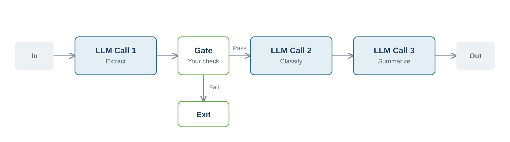
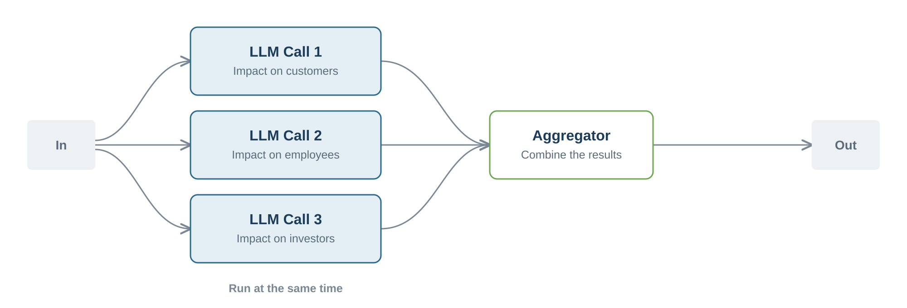
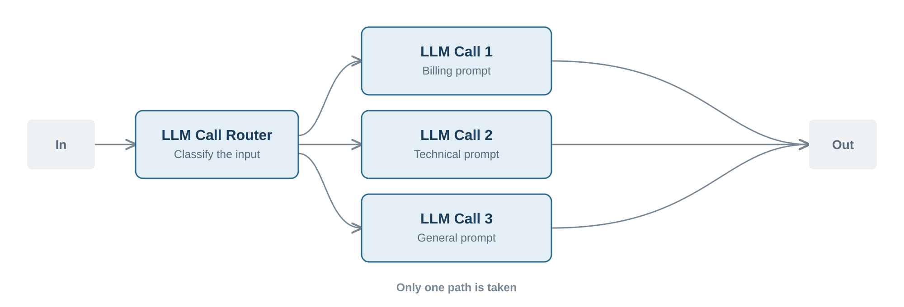
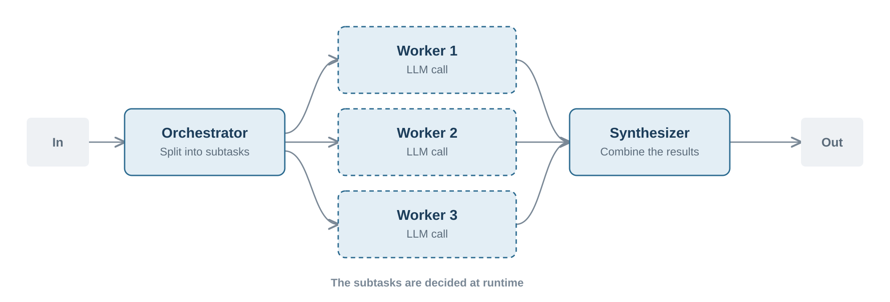
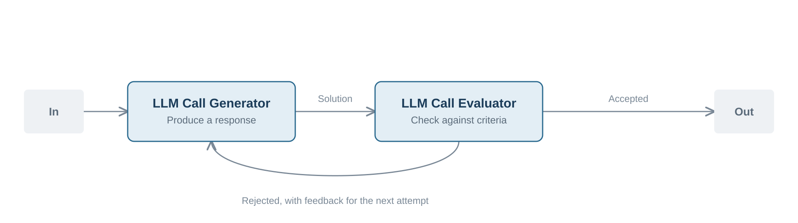

# Agentic Patterns

## The Workflow Patterns

The fundamentals section explained the difference between workflows, where your code decides the steps, and agents, where the model decides. On the workflow side a small set of recurring shapes covers most multi-step tasks. Each one below is a genuine **pattern**, a named and reusable topology that you could draw as a box diagram, that solves one specific recurring problem and slots into a system without changing anything else around it.

**Chain** breaks a complex task into sequential steps and feeds the output of each model call into the next one. It is slower but more accurate. Use it when a task is too big for a single prompt but splits cleanly into steps, for example extract, then classify, then summarize.



**Parallelization** runs several independent model calls at the same time and combines the results. It is ideal when you need to analyze many items, or one item from several perspectives. You can evaluate the impact of a change on customers, employees, and investors at the same time and then combine the answers.



**Routing** uses a first model call to classify the input and then sends it to a specialized prompt, pipeline, or model. A support assistant might send a "charged twice" message to a billing specialist prompt and a "build won't compile" message to a technical one. Each message is then handled better than a single generic prompt could handle it.



**Orchestrator-Workers** handles tasks whose subtasks cannot be predicted upfront. An orchestrator call splits the problem into subtasks at runtime, workers handle them, often in parallel, and a final call combines the results. This is more dynamic than a fixed chain because the model decides how to split the work. There is also a version of this pattern that uses full agents instead of single model calls, and it comes up in the multi-agent patterns below.



**Evaluator-Optimizer** introduces a feedback loop. One call generates a response, and another call evaluates it against your criteria. If the response is not good enough, the feedback is used for an improved retry. This repeats until the response passes or a limit is reached. It is the evaluation idea from the testing section turned into an improvement loop at runtime. When the generator and the evaluator are two agents instead of two model calls, this shape is usually called **LLM as a judge**, and you will meet it again in the multi-agent patterns below.



All of these are composition patterns. Pick the simplest one that fits, and move to the next one only when the task demands it. Beyond them sits the fully autonomous agent, which is the tool calling loop directing itself.

## Patterns for a Single Agent

The workflow patterns describe how you combine several model calls. This part covers how you shape one agent, and all of it lives in the harness, which is everything around the model that turns a single call into a working agent.

Each pattern below is a component you put inside that harness, and each one became popular because an autonomous agent runs into the same few problems in almost every project. The context window fills up, the model gets confused by too many choices, or an action needs a person in the loop. Agent Skills and Tool Search decide what gets loaded into the context, Plan and Execute decides how the work is split into steps, and Human-in-the-Loop decides where a person enters the flow.

It helps to split the harness into an inner and an outer part. The inner harness is whatever the model or the agent framework already ships with, so an SDK, a default loop, and default tool handling. The outer harness is what you add on top for your own task, so your own skills, your own MCP servers, and your own approval steps. Everything in this section lives in that outer layer, because it is the part you get to design.

**Agent Skills** are reusable instruction packages that the agent loads only when it needs them.

```
my-skill/
├── SKILL.md          # Required: metadata + instructions
├── scripts/          # Optional: executable code
├── references/       # Optional: documentation
├── assets/           # Optional: templates, resources
└── ...               # Any additional files or directories
```

The problem they solve is that an agent often has to know a lot, such as how your company formats invoices, how a refund is approved, or how a report should look. If you put all of that into the system prompt, you waste context on every request and the model has trouble finding the part that matters. With skills, each package is a small file with a name and a short description. Only the names and descriptions are loaded at the start, and the full instructions are loaded when the task matches. This idea is called progressive disclosure. The agent knows what it *could* learn, and learns the details on demand.

A common misunderstanding is to treat Agent Skills and MCP as competitors, but they solve different problems. MCP gives an agent access to external tools and data sources, while Agent Skills give it the know-how, the instructions, and often executable scripts for how to do a task well. In practice the two work together rather than replacing each other.

**Tool Search** applies the same idea to tools instead of instructions. The problem it solves is that an agent is only as capable as the tools it can reach, but sending hundreds of tool definitions with every request costs a lot of tokens and makes the model pick the wrong tool more often. Instead of loading everything upfront, the agent gets one search tool and looks up the others when it needs them, so only the two or three definitions that are relevant to the current step are loaded. Other frameworks tackle this differently. The `UnfoldingTool` of Embabel, for example, skips the search step entirely and lets the agent unlock a whole group of tools by invoking a single facade tool.

**Plan and Execute** asks the model to write down a list of steps before it starts working, and then to work through the list and mark the steps as done. The problem it solves is that agents lose track during long tasks. They forget a subtask, repeat one they already finished, or stop too early. A visible plan also helps you, because you can see what the agent intends to do before it does it.

```
Progress: 2/4 tasks completed (50%)
[✓] Classify the ticket as a billing issue
[✓] Look up the customer's order history
[→] Draft a reply with the refund options
[ ] Check the reply against the support policy
```

**Human-in-the-Loop** puts a person into the decision path of the agent. There are two common forms. The agent can ask a question when the input is ambiguous instead of guessing, and it can ask for approval before an action that is expensive or hard to undo, such as sending an email or deleting a record. The problem it solves is that autonomy and risk grow together. A confident wrong guess is worse than a short question, and an approval step lets you give an agent real permissions without giving up control.

## Multi-Agent Patterns

The fundamentals section ended with a clear recommendation. Keep one agent in charge, and add a second one only where it pays off. Two patterns do exactly that. You know the first one already, because **LLM as a judge** is the Evaluator-Optimizer pattern from above with a second agent as the judge. The other one is Subagents.

**Subagents** move a part of the work into a separate agent with its own context, its own tools, and its own prompt. The main agent gives it a task and receives only the result. This solves two problems at once. A large research step would otherwise fill the main context with material that is needed only once, and one agent with tools for many different jobs is harder to control than several small agents that each do one job well. Structurally this is the Orchestrator-Workers pattern from above, applied to agents instead of single model calls, so the same diagram shape fits, with each worker being a full agent rather than one model call.
The structure is the same, but the reason you choose it is different, and that is worth keeping in mind, because Subagents is more than a new name for the same idea. Orchestrator-Workers earns its place when the subtasks cannot be predicted upfront and the model has to split the work at runtime. A subagent is often worth it even when the split is completely predictable, simply because it keeps the main context clean and the tool set of each agent small. So you can end up with subagents for a task you could have written down as a fixed list of steps, and that is still the right call.
In both patterns the main agent stays in charge. It delegates a task and reads the result, and that is what keeps such a system easy to follow. When the agents live in different systems, a protocol such as **Agent-to-Agent (A2A)** lets them find and call each other, in the same way MCP lets one agent reach external tools.
Just like the workflow patterns, none of the patterns above are required from the start. Add one when you feel the specific problem it solves. Larger setups, where many agents work in parallel and coordinate with each other over a long time, are still proving their value, so they are not the place to start.
